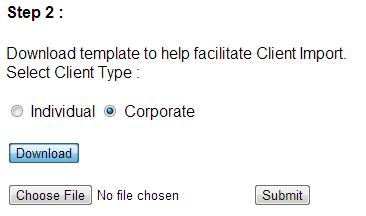
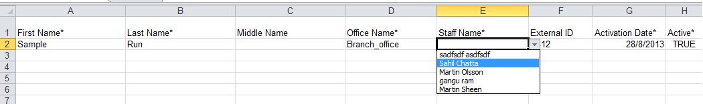
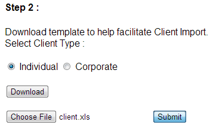
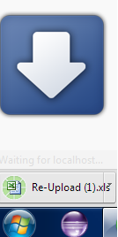
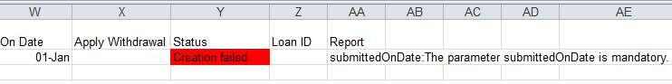

Demo Import
===========

1. Download template.

   
   
2. Open the downloaded template.
   
   

3. Enter the required data.

   
   
4. Upload the entered data.

   
   
5. In case of erroneous entries in some rows.

   

6. See the error report, fix it and re-upload.

   
